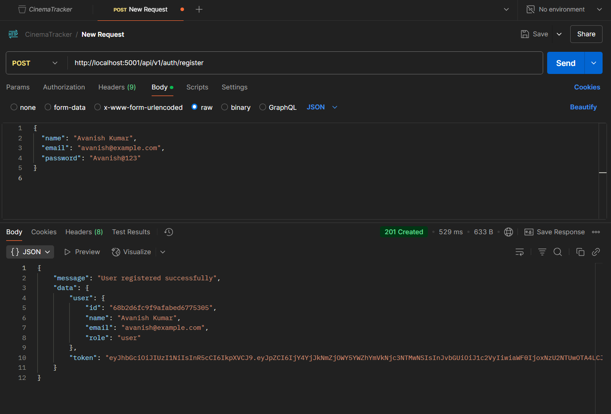
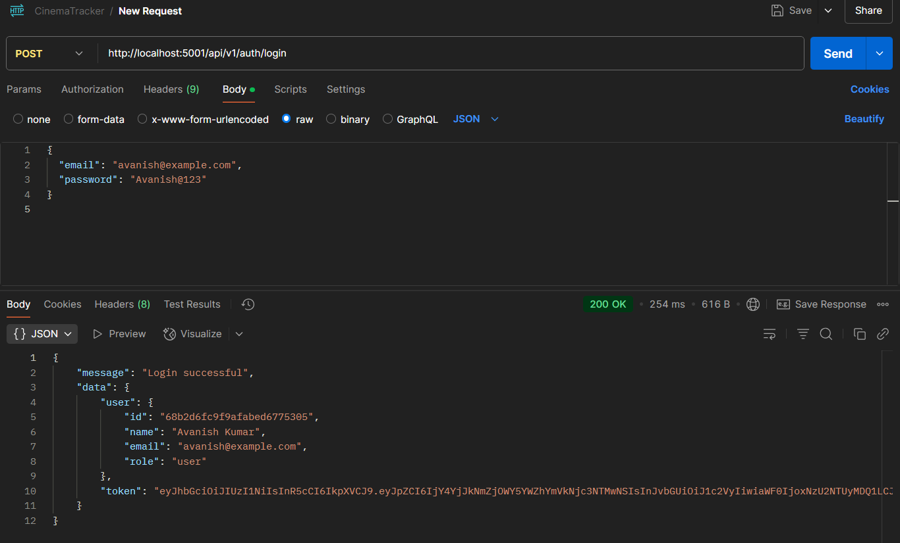
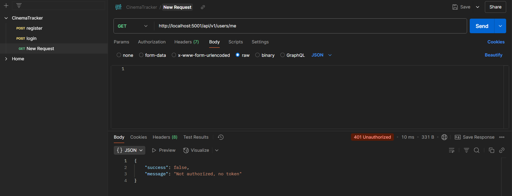
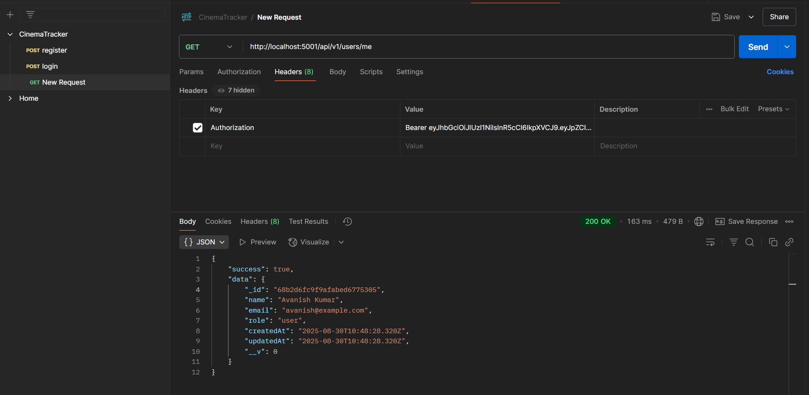

# Full-Stack Movie Tracker Application

This is a production-ready, full-stack web application that allows users to manage a list of their favorite movies and TV shows. The application supports user authentication, role-based permissions, full CRUD operations, an admin approval workflow for new entries, and cloud-based image uploads.

This project is built with a modern tech stack, following best practices for scalability, maintainability, and security as outlined in the assessment criteria.

## Core Features

-   **Secure JWT Authentication**: Full user registration and login system.
-   [cite_start]**Role-Based Access Control**: Differentiates between `admin` and `user` roles, restricting permissions appropriately[cite: 11].
-   [cite_start]**Full CRUD for Media**: Authenticated users can Create, Read, Update, and Delete their own media entries[cite: 11].
-   [cite_start]**Admin Approval Workflow**: New entries submitted by users are set to a 'pending' state and are only visible to others after an admin approves them[cite: 11]. [cite_start]Users can see the status of their own submissions[cite: 11].
-   [cite_start]**Dynamic Data Table with Infinite Scroll**: Media entries are displayed in a responsive table that loads more data as the user scrolls[cite: 11].
-   [cite_start]**Cloud Image Uploads**: Supports uploading poster images for entries, which are stored securely in Cloudinary[cite: 11].
-   **Client-Side Validation**: Forms use Zod for instant user feedback, improving the user experience.
-   [cite_start]**API Documentation**: A live, interactive Swagger/OpenAPI documentation for the backend API[cite: 7].

## Tech Stack

### Frontend
-   **Framework**: React.js (with Vite)
-   **Styling**: Tailwind CSS
-   **State Management**: Zustand
-   **Data Fetching**: TanStack Query (React Query)
-   **Routing**: React Router
-   **Tables**: TanStack Table (Headless)

### Backend
-   **Framework**: Node.js with Express.js
-   **Database**: MongoDB with Mongoose ODM
-   **Authentication**: JSON Web Tokens (JWT)
-   **File Uploads**: Cloudinary for object storage, Multer for handling multipart/form-data.
-   **Validation**: Zod for API request validation.

### DevOps
-   [cite_start]**Containerization**: Docker, Docker Compose 
-   [cite_start]**CI/CD**: (Placeholder for GitHub Actions setup) [cite: 8]

## Project Structure

This project uses a monorepo structure, with two distinct applications in the `backend` and `frontend` directories.

```
/
├── backend/        # Node.js Express API
├── frontend/       # React.js Client Application
└── README.md       # This file
```

## [cite_start]Local Setup Instructions [cite: 3]

### Prerequisites
-   Node.js (v18 or later)
-   npm / yarn
-   MongoDB instance (local or a free Atlas account)
-   A free Cloudinary account for image uploads.

### 1. Clone the Repository
```sh
git clone <your-repo-url>
cd <your-repo-name>
```

### 2. Backend Setup
```sh
# Navigate to the backend directory
cd backend

# Install dependencies
npm install

# Create the environment file
cp .env.example .env
```
Now, open the `.env` file and add your credentials for `MONGO_URI`, `JWT_SECRET`, and your Cloudinary account.

```sh
# Start the backend server
npm start
```
The backend will be running on `http://localhost:5001`.

### 3. Frontend Setup
Open a **new terminal** for the frontend.
```sh
# Navigate to the frontend directory from the root
cd frontend

# Install dependencies
npm install
```
Create a `.env` file in the `frontend` directory and add the following variable, pointing to your running backend.
```env
VITE_API_BASE_URL=http://localhost:5001
```
```sh
# Start the frontend development server
npm run dev
```
The frontend will be running on `http://localhost:5173`.

## [cite_start]Docker Setup [cite: 3]

A `docker-compose.yml` file is provided for a streamlined setup (pending creation). To run the entire stack with Docker:
1.  Ensure you have Docker and Docker Compose installed.
2.  Complete the `.env` file setup for the backend as described above.
3.  From the root directory, run:
    ```sh
    docker-compose up --build
    ```

## [cite_start]API Documentation [cite: 7]

The backend includes interactive API documentation served by Swagger. Once the backend server is running, you can access it at:

[**http://localhost:5001/api-docs**](http://localhost:5001/api-docs)

## [cite_start]Database Schema [cite: 4]

The application uses Mongoose for schema-on-read with MongoDB. The primary collections are `users` and `mediaEntries`. (Refer to the code in `backend/src/models/` for detailed schema definitions).

## [cite_start]Testing & CI/CD Instructions [cite: 8]

-   **Backend Testing**: Navigate to the `backend` directory and run `npm test`. (Jest test suites are to be implemented).
-   **Frontend Testing**: Navigate to the `frontend` directory and run `npm test`. (React Testing Library tests are to be implemented).
-   **CI/CD**: A GitHub Actions workflow is planned for running tests and linting automatically on pull requests.

## [cite_start]Demo Credentials & Live Demo [cite: 9]

-   **Live Demo Link**: (Placeholder for your deployed application link)
-   **Demo Credentials**:
    -   **User Role**: Register a new account through the UI.
    -   **Admin Role**: After registering a user, manually update their `role` in the MongoDB `users` collection from `'user'` to `'admin'`.

## API Usage & Testing Examples (Postman)

Here are Postman examples demonstrating the core authentication flow.

### 1. User Registration

A new user is created by sending a `POST` request to the `/auth/register` endpoint.



### 2. User Login

A registered user can log in via the `POST /auth/login` endpoint to receive a JWT access token.



### 3. Accessing Protected Routes (Failure)

Attempting to access a protected route like `GET /users/me` without providing a valid Bearer Token results in a `401 Unauthorized` error, as expected.



### 4. Accessing Protected Routes (Success)

Providing the JWT as a Bearer Token in the Authorization header grants access to protected routes.

